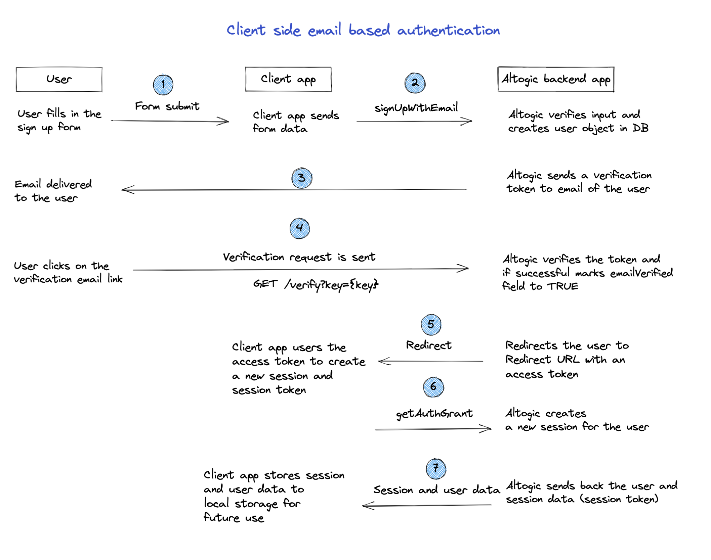
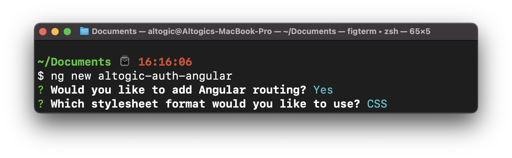

# How to Authenticate Email and Password Using Angular & Altogic

## Introduction
[Altogic](https://www.altogic.com) is a Backend as a Service (BaaS) platform and provides a variety of services in modern web and mobile development. Most modern applications using React or other libraries/frameworks require knowing the identity of a user. And this necessity allows an app to securely save user data and session in the cloud and provide more personalized functionalities and views to users.

Altogic has an authentication service that integrates and implements well in JAMstack apps. It has a ready-to-use [Javascript client library](https://www.npmjs.com/package/altogic), and it supports many authentication providers such as email/password, phone number, magic link, and OAuth providers like Google, Facebook, Twitter, Github, etc.,

In this tutorial, we will implement email/password authentication with Angular and take a look at how as a Angular developer, we build applications and integrate with Altogic Authentication.

After completion of this tutorial, you will learn the following:

- How to create sample screens to display forms like login and signup.
- How to create a home screen and authorize only logged-in users.
- How to create an authentication flow by conditionally rendering between these pages whether a user is logged in.
- How to authenticate users using the magic link
- How to update user profile info and upload a profile picture
- How to manage active sessions of a user
- And we will integrate Altogic authentication with the email/password method.

If you are new to Angular applications, this tutorial is definitely for you to understand the basics and even advanced concepts.


## How email-based sign-up works in Altogic
By default, when you create an app in Altogic, email-based authentication is enabled. In addition, during email-based authentication, the email address of the user is also verified. Below you can find the flow of email and password-based sign-up process.



If email verification is disabled, then after step 2, Altogic immediately returns a new session to the user, meaning that steps after step #2 in the above flow are not executed. You can easily configure email-based authentication settings from the **App Settings > Authentication** in Altogic Designer. One critical parameter you need to specify is the Redirect URL, you can also customize this parameter from **App Settings > Authentication**. Finally, you can also customize the email message template from the A**pp Settings > Authentication > Messaget Templates**.

## Prerequisites
To complete this tutorial, make sure you have installed the following tools and utilities on your local development environment.
- [VsCode](https://code.visualstudio.com/download)
- [NodeJS](https://nodejs.org/en/download/)
- [Angular App](https://angular.io/guide/setup-local)
- You also need an Altogic Account. If you do not have one, you can create an account by [signin up for Altogic](https://designer.altogic.com/).


## Creating an Altogic App
We will use Altogic as a backend service platform, so let’s visit [Altogic Designer](https://designer.altogic.com/) and create an account.


After creating an account, you will see the workspace where you can access your apps.

Click + New app and follow the instructions;

1. In the App name field, enter a name for the app.
2. Enter your subdomain.
3. Choose the deployment location.
4. And select your free execution environment pricing plan.


Then click Next and select Basic template. This template creates a default user data model for your app which is required by **Altogic Client Library** to store user data and manage authentication. You can add additional user fields to this data model (e.g., name, surname, gender, birthdate) and when calling the `signUpWithEmail` method of the client library you can pass these additional data.

> **Tip**: If you do not select the basic template, instead selected the blank app template the user data model will not be created for your app. In order to use the Altogic Client Library's authentication methods you need a user data model to store the user data. You can easily create a new data model manually and from the App Settings > Authentication mark this new data model as your user data model.

Then click Next to confirm and create an app.

Awesome! We have created our application; now click/tap on the **newly created app to launch the Designer.** In order to access the app and use the Altogic client library, we should get `envUrl` and `clientKey` of this app. You can use any one of the API base URLs specified for your app environment as your envUrl.

Click the **Home** icon at the left sidebar to copy the `envUrl` and `clientKey`.


Once the user created successfully, our Angular app will route the user to the Verification page, and a verification email will be sent to the user’s email address. When the user clicks the link in the mail, the user will navigate to the redirect page to grant authentication rights. After successfully creating a session on the Redirect page, users will be redirected to the Home page.

> If you want, you can deactivate or customize the mail verification from App Settings -> Authentication in Logic Designer.

 

## Install the Angular CLI
You use the Angular CLI to create projects, generate application.

To install the Angular CLI, open a terminal window and run the following command:

```bash
npm install -g @angular/cli
```

## Create a new Angular app
To create a new Angular app, open a terminal window and run the following command:

```bash
ng new altogic-auth-angular
```
I showed you which options to choose in the image I will give you below. You can choose the same options as I did.
 

#### Navigate to folder
```bash
cd altogic-auth-angular
```

## Integrating with Altogic

Our backend and frontend is now ready and running on the server. ✨

Now, we can install the Altogic client library to our React app to connect our frontend with the backend.

```bash
# using npm
npm install altogic
# OR is using yarn
yarn add altogic
```

Let’s create a `libs/` folder inside the `src/app` directory to add **altogic.ts** file.

Open **altogic.ts** and paste below code block to export the altogic client instance.

```ts
// src/app/libs/altogic.ts
import { createClient } from 'altogic';

const ENV_URL = ''; // replace with your envUrl
const CLIENT_KEY = ''; // replace with your clientKey
const API_KEY = ''; // replace with your apiKey

const altogic = createClient(ENV_URL, CLIENT_KEY, {
	apiKey: API_KEY,
	signInRedirect: '/login',
});

export default altogic;
```
> Replace ENV_URL, CLIENT_KEY and API_KEY which is shown in the **Home** view of [Altogic Designer](https://designer.altogic.com/).


## Let's generate our page components

We will generate our page components using the Angular CLI. Open your terminal window and run the following command:

```bash
ng generate component pages/home && 
ng generate component pages/login && 
ng generate component pages/register && 
ng generate component pages/login-with-magic-link &&
ng generate component pages/profile && 
ng generate component pages/auth-register
```

## Let's generate our shared components
we will generate our shared components using the Angular CLI. Open your terminal window and run the following command:

```bash
ng generate component components/avatar &&
ng generate component components/sessions &&
ng generate component components/user-info
```

## Define our home page component
Open `home.component.html` and paste below code block:

```html
<div class="flex items-center justify-center gap-4 h-screen">
  <a routerLink="/login-with-magic-link" class="border px-4 py-2 font-medium text-xl">
    Login With Magic Link
  </a>
  <a routerLink="/login" class="border px-4 py-2 font-medium text-xl">
    Login
  </a>
  <a routerLink="/register" class="border px-4 py-2 font-medium text-xl">
    Register
  </a>
</div>
```

## Define our login page component

Open `login.component.ts` and paste below code block to define our login page component.

In this component, we will use the `signInWithEmail` method of the *Altogic* client library to sign in the user.

```ts
import { Component, OnInit } from '@angular/core';
import { FormBuilder, FormControl, Validators } from '@angular/forms';
import altogic from '../../libs/altogic';
import { APIError } from 'altogic';
import { Router } from '@angular/router';
import { AuthService } from '../../shared/auth.service';

@Component({
  selector: 'app-login',
  templateUrl: './login.component.html',
})
export class LoginComponent implements OnInit {
  loginForm = this.fb.group({
    email: ['', Validators.required],
    password: ['', Validators.required],
  });
  errors: APIError | null = null;
  loading = false;

  constructor(private fb: FormBuilder, private router: Router, private authService: AuthService) {}
  ngOnInit(): void {}

  async submitHandler() {
    const { email, password } = this.loginForm.value;
    if (!email || !password) return;
    this.loading = true;
    this.errors = null;

    const { user, session, errors } = await altogic.auth.signInWithEmail(email, password);
    this.loading = false;

    if (errors) {
      this.errors = errors;
      return;
    }

    this.authService.setUserAndSession(user, session);
    await this.router.navigate(['profile']);
  }
}
```

then open your `login.component.html` and paste below code block:
```angular2html
<section class="flex flex-col items-center justify-center h-96 gap-4">
  <form (ngSubmit)="submitHandler()" [formGroup]="loginForm" class="flex flex-col gap-2 w-full md:w-96">
    <h1 class="self-start text-3xl font-bold">Login to your account</h1>
    <ng-container *ngIf="errors">
      <div *ngFor="let error of errors.items" class="bg-red-600 text-white text-[13px] p-2">
        <p>{{ error.message }}</p>
      </div>
    </ng-container>
    <input formControlName="email" type="email" placeholder="Type your email" required />
    <input formControlName="password" type="password" placeholder="Type your password" required />
    <div class="flex justify-between gap-4 items-start">
      <a class="text-indigo-600" routerLink="/register">Don't have an account? Register now</a>
      <button
        type="submit"
        [disabled]="!loginForm.valid || loading"
        class="border py-2 px-3 border-gray-500 hover:bg-gray-500 hover:text-white transition shrink-0"
      >
        Login
      </button>
    </div>
  </form>
</section>
```

## Define our login with magic link page component

Open `login-with-magic-link.component.ts` and paste below code block to define our register page component.

In this component, we will use the `altogic.auth.sendMagicLinkEmail()` method of the **Altogic** client library to send the magic link to the user's email.

```ts
import { Component, OnInit } from '@angular/core';
import { FormBuilder, Validators } from '@angular/forms';
import { Router } from '@angular/router';
import { AuthService } from '../../shared/auth.service';
import altogic from '../../libs/altogic';
import { APIError } from 'altogic';

@Component({
  selector: 'app-login-with-magic-link',
  templateUrl: './login-with-magic-link.component.html',
})
export class LoginWithMagicLinkComponent implements OnInit {
  magicForm = this.fb.group({
    email: ['', Validators.required],
  });
  errors: APIError | null = null;
  loading = false;
  showMessage = false;
  constructor(private fb: FormBuilder, private router: Router, private authService: AuthService) {}

  ngOnInit(): void {}

  async submitHandler() {
    const { email } = this.magicForm.value;
    if (!email) return;
    this.loading = true;
    this.errors = null;
    this.showMessage = false;

    const { errors } = await altogic.auth.sendMagicLinkEmail(email);
    this.loading = false;

    if (errors) {
      this.errors = errors;
      return;
    }

    this.showMessage = true;
    this.magicForm.reset();
  }
}
```

then open your `login-with-magic-link.component.html` and paste below code block:

```angular2html
<section class="flex flex-col items-center justify-center h-96 gap-4">
  <form (ngSubmit)="submitHandler()" [formGroup]="magicForm" class="flex flex-col gap-2 w-full md:w-96">
    <h1 class="self-start text-3xl font-bold">Login with magic link</h1>

    <div *ngIf="showMessage" class="bg-green-600 text-white text-[13px] p-2">
      Your magic link has been sent to your email address.
    </div>

    <ng-container *ngIf="errors">
      <div *ngFor="let error of errors.items" class="bg-red-600 text-white text-[13px] p-2">
        <p>{{ error.message }}</p>
      </div>
    </ng-container>

    <input formControlName="email" type="email" placeholder="Type your email" required />
    <div class="flex justify-between gap-4 items-start">
      <a class="text-indigo-600" routerLink="/register">Don't have an account? Register now</a>
      <button
        type="submit"
        [disabled]="!magicForm.valid || loading"
        class="border py-2 px-3 border-gray-500 hover:bg-gray-500 hover:text-white transition shrink-0"
      >
        Send magic link
      </button>
    </div>
  </form>
</section>
```

## Define our register page component

Open `register.component.ts` and paste below code block to define our register page component.

```ts
import { Component, OnInit } from '@angular/core';
import { FormBuilder, Validators } from '@angular/forms';
import { Router } from '@angular/router';
import { AuthService } from '../../shared/auth.service';
import { APIError } from 'altogic';
import altogic from '../../libs/altogic';

@Component({
  selector: 'app-register',
  templateUrl: './register.component.html',
})
export class RegisterComponent implements OnInit {
  registerForm = this.fb.group({
    name: ['', Validators.required],
    email: ['', Validators.required],
    password: ['', Validators.required],
  });
  errors: APIError | null = null;
  loading = false;
  isNeedToVerify = false;
  constructor(private fb: FormBuilder, private router: Router, private authService: AuthService) {}

  ngOnInit(): void {}

  async submitHandler() {
    const { email, password, name } = this.registerForm.value;
    if (!email || !password || !name) return;
    this.loading = true;
    this.errors = null;
    this.isNeedToVerify = false;

    const { user, session, errors } = await altogic.auth.signUpWithEmail(email, password, name);
    this.loading = false;

    if (errors) {
      this.errors = errors;
      return;
    }

    if (!session) {
      this.isNeedToVerify = true;
      this.registerForm.reset();
      return;
    }

    this.authService.setUserAndSession(user, session);
    await this.router.navigate(['profile']);
  }
}
```

then open your `register.component.html` and paste below code block:

```angular2html
<section class="flex flex-col items-center justify-center h-96 gap-4">
  <form (ngSubmit)="submitHandler()" [formGroup]="registerForm" class="flex flex-col gap-2 w-full md:w-96">
    <h1 class="self-start text-3xl font-bold">Create an account</h1>

    <div *ngIf="isNeedToVerify" class="bg-green-500 text-white p-2">
      Your account has been created. Please check your email to verify your account.
    </div>

    <ng-container *ngIf="errors">
      <div *ngFor="let error of errors.items" class="bg-red-600 text-white text-[13px] p-2">
        <p>{{ error.message }}</p>
      </div>
    </ng-container>

    <input formControlName="email" type="email" placeholder="Type your email" required />
    <input formControlName="name" type="text" placeholder="Type your name" required />
    <input formControlName="password" type="password" placeholder="Type your password" required />
    <div class="flex justify-between gap-4">
      <a class="text-indigo-600" routerLink="/login">Already have an account?</a>
      <button
        [disabled]="!registerForm.valid || loading"
        type="submit"
        class="border py-2 px-3 border-gray-500 hover:bg-gray-500 hover:text-white transition shrink-0"
      >
        Register
      </button>
    </div>
  </form>
</section>
```

## Generate an Auth service
We will generate a service to handle the authentication process. Run the following command to generate a service:
```bash
ng generate service shared/auth
```
In the `auth.service.ts` file, we will add the following code block to handle the authentication process.

```ts
import { Injectable } from '@angular/core';
import { Session, User } from 'altogic';
import altogic from '../libs/altogic';

@Injectable({
  providedIn: 'root',
})
export class AuthService {
  user: User | null = altogic.auth.getUser();
  session: Session | null = altogic.auth.getSession();

  async logout() {
    await altogic.auth.signOut();
    this.setUserAndSession(null, null);
  }

  setUserAndSession(user: User | null, session: Session | null) {
    this.user = user;
    this.session = session;

    if (session && user) {
      altogic.auth.setUser(user);
      altogic.auth.setSession(session);
    }
  }

  setUser(user: User | null) {
    this.user = user;
    if (user) altogic.auth.setUser(user);
  }
}
```

## Generate auth and guest guard
We will generate some **guards** to protect our routes. Run the following command to generate a guards:
```bash
ng generate guard shared/auth && ng generate guard shared/guest
``` 
> then you should select the `CanActivate` option for each by pressing enter.

## Define auth guard 
In this guard, we will check if the user is logged in or not. If the user is logged in, we will return true, otherwise, we will redirect the user to the login page.

Replace the `auth.guard.ts` file with the following code block:
```ts
import { Injectable } from '@angular/core';
import { ActivatedRouteSnapshot, CanActivate, Router, RouterStateSnapshot, UrlTree } from '@angular/router';
import { Observable } from 'rxjs';
import { AuthService } from './auth.service';

@Injectable({
  providedIn: 'root',
})
export class AuthGuard implements CanActivate {
  constructor(private authService: AuthService, private router: Router) {}
  canActivate(
    route: ActivatedRouteSnapshot,
    state: RouterStateSnapshot
  ): Observable<boolean | UrlTree> | Promise<boolean | UrlTree> | boolean | UrlTree {
    if (this.authService.user) return true;
    this.router.navigate(['login']);
    return false;
  }
}
```

## Define guest guard
In this guard, we will check if the user is logged in or not. If the user is logged in, we will return false and redirect the user to the profile page, otherwise, we will return true.

Replace the `guest.guard.ts` file with the following code block:

```ts
import { Injectable } from '@angular/core';
import { ActivatedRouteSnapshot, CanActivate, Router, RouterStateSnapshot, UrlTree } from '@angular/router';
import { Observable } from 'rxjs';
import { AuthService } from './auth.service';

@Injectable({
  providedIn: 'root',
})
export class GuestGuard implements CanActivate {
  constructor(private authService: AuthService, private router: Router) {}
  canActivate(
    route: ActivatedRouteSnapshot,
    state: RouterStateSnapshot
  ): Observable<boolean | UrlTree> | Promise<boolean | UrlTree> | boolean | UrlTree {
    if (this.authService.user) {
      this.router.navigate(['profile']);
      return false;
    }
    return true;
  }
}
```

## Define the routes
Open `app-routing.module.ts` and paste below code block to define the routes.

```ts
import { NgModule } from '@angular/core';
import { RouterModule, Routes } from '@angular/router';
import { LoginComponent } from './pages/login/login.component';
import { RegisterComponent } from './pages/register/register.component';
import { HomeComponent } from './pages/home/home.component';
import { LoginWithMagicLinkComponent } from './pages/login-with-magic-link/login-with-magic-link.component';
import { ProfileComponent } from './pages/profile/profile.component';
import { AuthGuard } from './shared/auth.guard';
import { GuestGuard } from './shared/guest.guard';
import { AuthRedirectComponent } from './pages/auth-redirect/auth-redirect.component';

const routes: Routes = [
  {
    path: '',
    component: HomeComponent,
    canActivate: [GuestGuard],
  },
  {
    path: 'profile',
    component: ProfileComponent,
    title: 'Profile Page',
    canActivate: [AuthGuard],
  },
  {
    path: 'login',
    component: LoginComponent,
    title: 'Login Page',
    canActivate: [GuestGuard],
  },
  {
    path: 'auth-redirect',
    component: AuthRedirectComponent,
    title: 'Auth Redirect Page',
  },
  {
    path: 'login-with-magic-link',
    component: LoginWithMagicLinkComponent,
    title: 'Login with Magic Link Page',
    canActivate: [GuestGuard],
  },
  {
    path: 'register',
    component: RegisterComponent,
    title: 'Register Page',
    canActivate: [GuestGuard],
  },
  {
    path: '**',
    redirectTo: '/',
  },
];

@NgModule({
  imports: [RouterModule.forRoot(routes)],
  exports: [RouterModule],
})
export class AppRoutingModule {}
```
